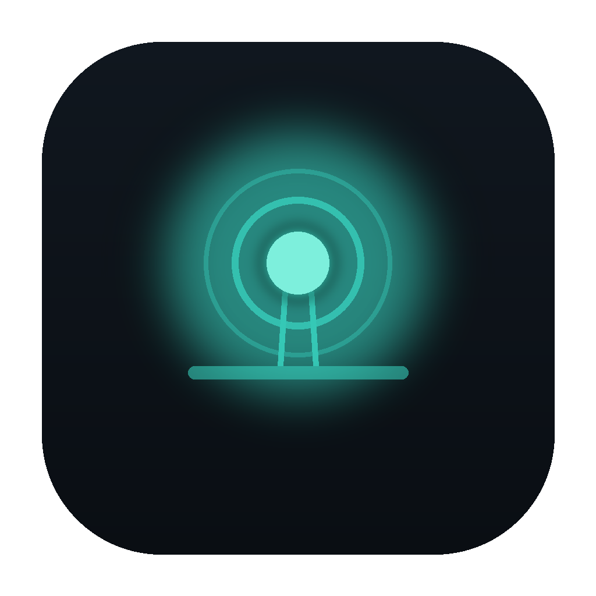
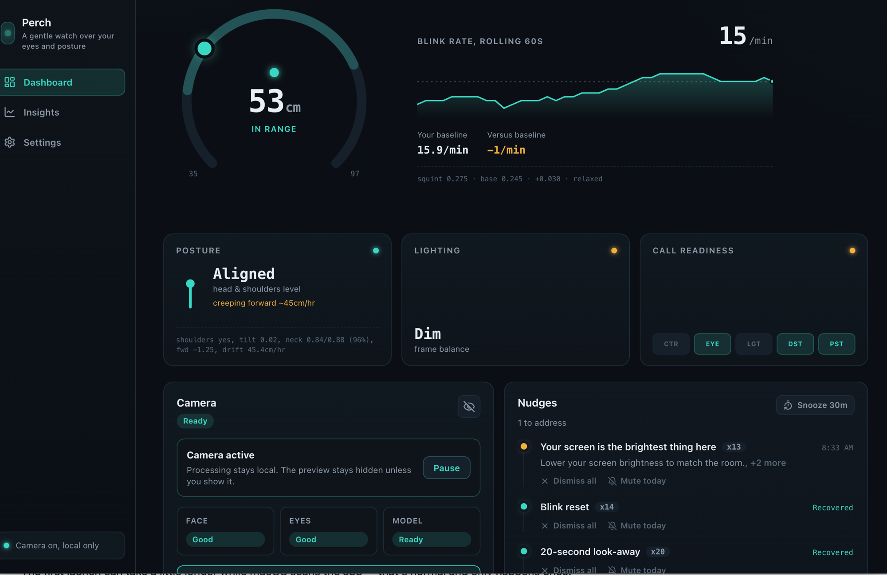
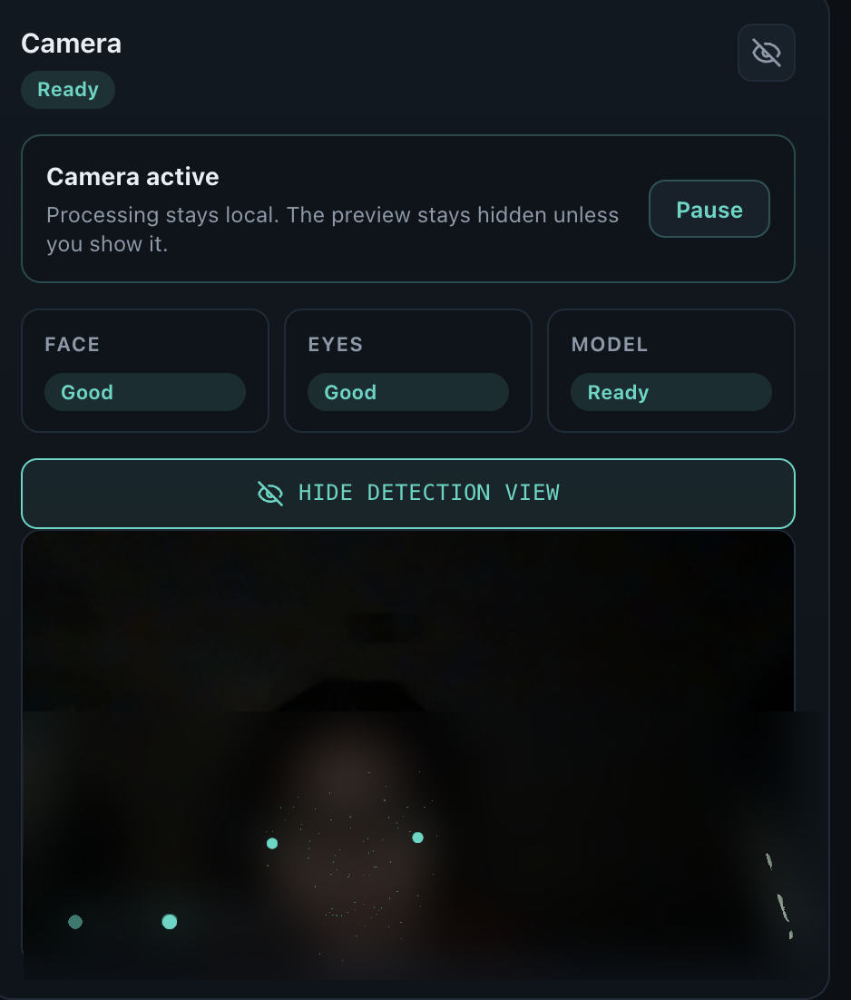
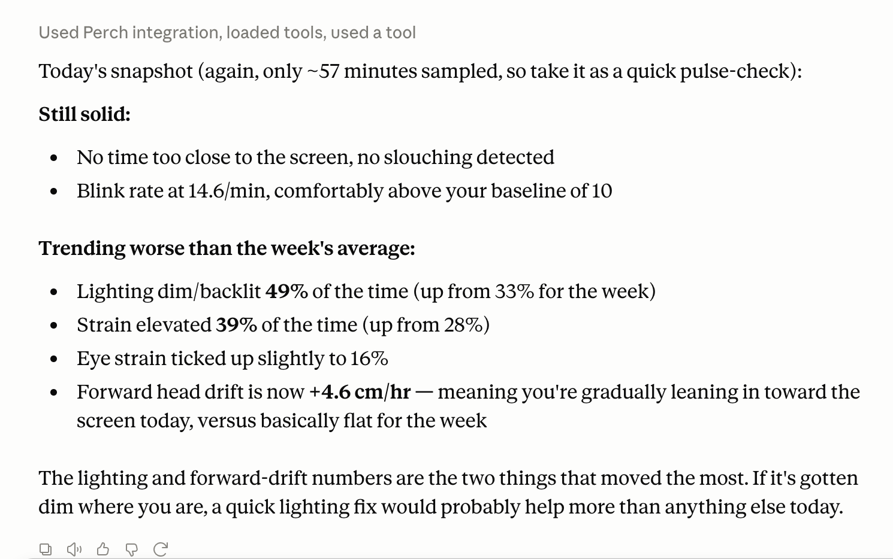

  
  <h1>Perch</h1>
  
<strong>A gentle, privacy-first desktop coach for your eyes and posture.</strong>

Perch uses your Mac's camera **locally** (on-device AI) to watch your blink rate, screen distance, posture, and lighting, then gives small, well-timed nudges to look away, sit back, or fix your setup. **No video, images, audio, or face data ever leaves your Mac.**

This public repository is used for **release downloads only**. The app source code is not published here.

---

## Download

Grab the newest build from the [**latest release**](https://github.com/sameera16/perch/releases/latest):

- **Apple Silicon Mac** → `Perch-<version>-arm64.dmg`
- **Intel Mac** → `Perch-<version>.dmg`

> **Not sure which Mac you have?** Click the **Apple menu → About This Mac** and look at **Chip**: if it starts with **Apple** (M1, M2, M3, or M4), choose Apple Silicon; if it says **Intel**, choose Intel.

### Install

1. Open the DMG and drag **Perch** into **Applications**.
2. In Applications, **right-click Perch → Open**, then click **Open** again.
   *(Perch isn't notarized by Apple yet, so this one-time step is required. After that it opens normally.)*
3. When macOS asks, **Allow** camera access.

The first launch can take a little longer while macOS scans the app. That's normal and only happens once.

---

## Ask Claude about your own data (optional)

The latest release also includes **`Perch-<version>.dxt`**, a local [Claude Desktop](https://claude.ai/download) extension. Double-click it to install (no terminal, no setup), then ask Claude natural-language questions about your own trends:

- *"When during the day is my posture worst?"*
- *"Is my blink rate below my baseline in the afternoons?"*
- *"Which nudges do I dismiss most?"*
- *"Which of my nudges actually work?"*

It's **read-only** and fully local: it reads only the small hourly aggregates Perch keeps on your machine (never video, images, or face landmarks), and nothing leaves your Mac except what you choose to send to Claude.

---

## Screenshots

### The dashboard

Live blink rate, screen distance, posture, lighting, and an at-a-glance status row, all computed on-device.

### Private by design

The camera preview is **off by default**, so Perch runs without ever showing you. When you do turn it on, you see live tracking points overlaid on the feed, and processing stays entirely on-device: no frame is saved or sent.

> *The face in this screenshot is blurred by us for the README. It's a real camera frame we didn't want on a public page, not an in-app effect.*

### Ask Claude about your trends

With the `.dxt` extension installed, Claude reads your local aggregates and answers questions in plain language.

---

## Roadmap

Perch is actively evolving. These are directions we are exploring for future releases (ideas, not promises, and always on Perch's terms: local-first, opt-in, and easy to undo):

- **A screen that adapts to your eyes.** Perch gently warms or dims your display in real time when it detects eye strain and poor lighting, entirely on-device.
- **Coaching that proves itself.** Building on the nudge-efficacy work in 0.3.0: weekly summaries of which nudges actually help you, and automatically easing off the ones that never do.
- **An agent that sets up your day for you.** With the extension and your calendar connected, Perch's Claude agent reads tomorrow's schedule and your recent strain patterns, then does the legwork: it schedules short eye-rest holds in the gaps between back-to-back meetings, prepares your screen for late-night work, and eases off nudges that have not been helping. It leaves you a short brief of what it changed, and you can undo anything in one click.
- **A coach that can act, not just report.** Optional, confirm-first actions Perch can take on your behalf based on your own patterns, always reversible.
- **Session and trend views.** "How was this focus block?" and "am I improving versus last month?", answered from your own history.

---

## Privacy

All processing happens **on-device**. Perch never uploads video, images, audio, face/pose landmarks, or screen contents. Optional anonymous analytics are **off by default**.

This is a behavior-coaching tool, not a medical device, and does not diagnose or detect any medical condition.
